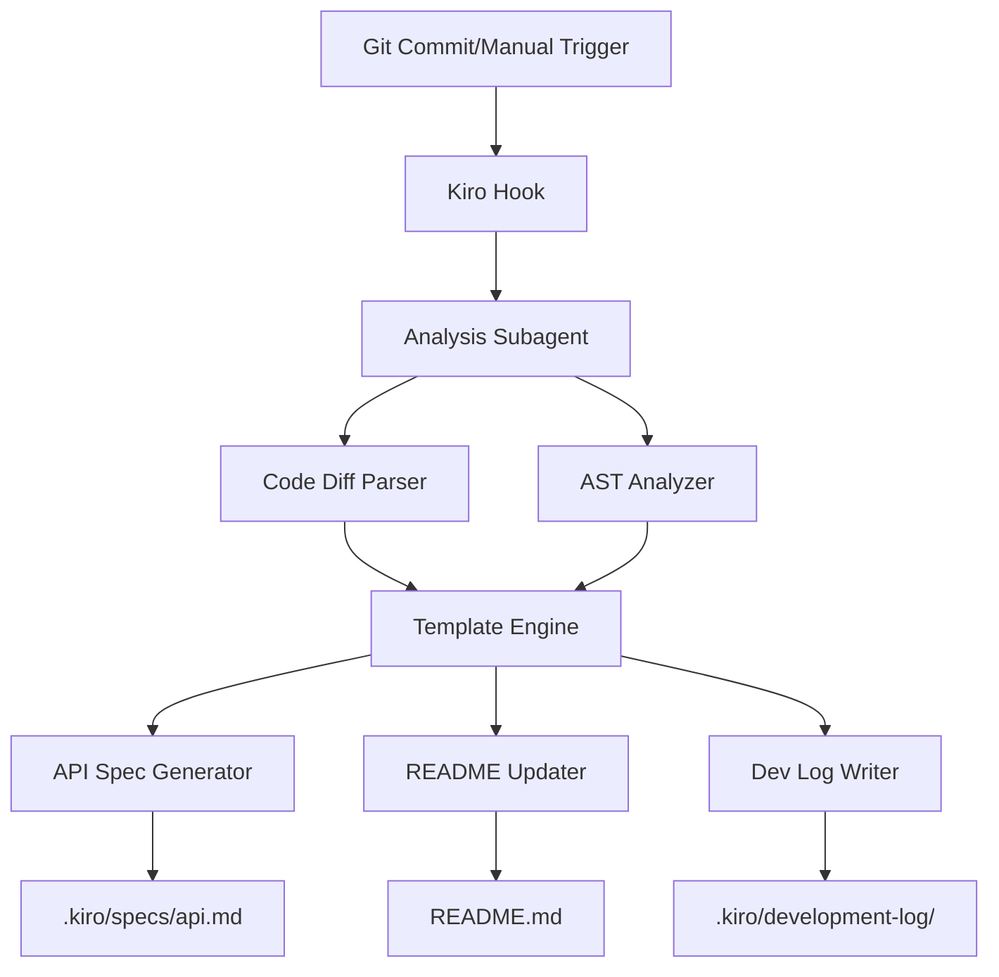

# Design Document

## Overview

The Autonomous Documentation Synchronization System is a Kiro-native solution that automatically maintains documentation consistency with code changes. The system operates through a trigger-based architecture using Kiro Hooks, employs a specialized Subagent for code analysis, and generates updates to key documentation artifacts including API specifications, README sections, and development logs.

The system follows a three-phase workflow: Detection → Analysis → Generation. When triggered (via git hooks or manual invocation), it analyzes code changes using AST parsing and diff analysis, then generates targeted documentation updates using predefined templates and AI-powered content generation.

## Architecture

The system consists of four main components:

1. **Trigger System**: Kiro Hooks that detect code changes and initiate the documentation sync process
2. **Analysis Engine**: A specialized Subagent that parses code changes and extracts documentation requirements
3. **Template Engine**: A collection of reusable templates for generating consistent documentation
4. **Output Manager**: Handles writing updates to .kiro/ directory files and README sections



## Components and Interfaces

### Trigger System
- **Kiro Hook Configuration**: JSON-based hook definitions for git events and manual triggers
- **Event Context**: Structured data passed to the analysis engine containing change metadata
- **Error Handling**: Graceful failure handling with logging and retry mechanisms

### Analysis Engine (Subagent)
- **Code Diff Parser**: Extracts added, modified, and deleted code sections
- **AST Analyzer**: Parses code structure to identify functions, classes, and API endpoints
- **Change Classifier**: Determines significance of changes and required documentation updates
- **Context Extractor**: Gathers relevant project context from existing .kiro/ files

### Template Engine
- **API Documentation Template**: Standardized format for endpoint documentation
- **Setup Instructions Template**: Consistent format for installation and configuration
- **Architecture Notes Template**: Pattern for describing system components
- **Template Registry**: Dynamic loading and customization of documentation patterns

### Output Manager
- **File Writer**: Handles atomic updates to documentation files
- **Markdown Formatter**: Ensures consistent formatting and structure preservation
- **Validation Engine**: Verifies generated content quality and completeness

## Data Models

### ChangeAnalysis
```typescript
interface ChangeAnalysis {
  timestamp: string;
  triggerType: 'git-hook' | 'manual';
  changedFiles: ChangedFile[];
  extractedAPIs: APIDefinition[];
  newFeatures: FeatureDescription[];
  architecturalChanges: ArchitecturalChange[];
  documentationRequirements: DocumentationRequirement[];
}
```

### ChangedFile
```typescript
interface ChangedFile {
  path: string;
  changeType: 'added' | 'modified' | 'deleted';
  diffContent: string;
  extractedFunctions: FunctionDefinition[];
  extractedClasses: ClassDefinition[];
}
```

### DocumentationRequirement
```typescript
interface DocumentationRequirement {
  type: 'api-spec' | 'readme-section' | 'dev-log' | 'steering-file';
  targetFile: string;
  section?: string;
  content: string;
  priority: 'high' | 'medium' | 'low';
}
```

### Template
```typescript
interface Template {
  name: string;
  type: 'api-doc' | 'setup-instructions' | 'architecture-notes';
  content: string;
  variables: TemplateVariable[];
}
```

## Correctness Properties

*A property is a characteristic or behavior that should hold true across all valid executions of a system-essentially, a formal statement about what the system should do. Properties serve as the bridge between human-readable specifications and machine-verifiable correctness guarantees.*

Property 1: Code analysis extraction completeness
*For any* code changes being analyzed, the system should extract all function signatures, class definitions, and API endpoints present in the changes
**Validates: Requirements 1.3**

Property 2: Change classification accuracy
*For any* code changes being processed, the system should correctly identify and classify new features, modified APIs, and architectural changes based on the change content
**Validates: Requirements 1.4**

Property 3: Analysis output structure consistency
*For any* completed analysis, the system should generate structured recommendations with consistent format and required fields
**Validates: Requirements 1.5**

Property 4: Documentation update triggering
*For any* detected changes (API changes, architectural changes, or new features), the system should update the corresponding documentation files in .kiro/specs/
**Validates: Requirements 2.1, 2.2, 2.3**

Property 5: README section synchronization
*For any* feature additions, API modifications, or function signature changes, the system should update the corresponding sections in the README with accurate information
**Validates: Requirements 3.1, 3.2, 3.3**

Property 6: Formatting and structure preservation
*For any* documentation updates (specifications, README sections, or log entries), the system should maintain existing markdown formatting, structure, and styling consistency
**Validates: Requirements 2.4, 3.4, 6.4**

Property 7: Post-update validation
*For any* completed documentation updates, the system should validate the generated content for consistency and ensure all links and references remain valid
**Validates: Requirements 2.5, 3.5**

Property 8: Development log entry creation
*For any* documentation updates processed, the system should create a timestamped development log entry in the .kiro/development-log/ directory
**Validates: Requirements 4.1, 4.4**

Property 9: Log entry content completeness
*For any* generated log entries, the system should include change descriptions, affected files, rationale, consistent formatting, and relevant metadata
**Validates: Requirements 4.2, 4.5**

Property 10: Related change grouping
*For any* multiple changes occurring in a single session, the system should group related modifications in one log entry rather than creating separate entries
**Validates: Requirements 4.3**

Property 11: Hook context passing
*For any* hook execution, the system should pass relevant context about the triggering event to the analysis engine
**Validates: Requirements 5.3**

Property 12: Hook execution logging
*For any* completed hook execution, the system should log the results and any errors encountered during the process
**Validates: Requirements 5.4**

Property 13: Template application consistency
*For any* documentation generation (API docs, setup instructions, or architecture notes), the system should use the appropriate predefined templates and follow established patterns
**Validates: Requirements 6.1, 6.2, 6.3**

Property 14: Default template handling
*For any* documentation generation when templates are missing, the system should use sensible defaults and allow for template customization
**Validates: Requirements 6.5**

## Error Handling

The system implements comprehensive error handling across all components:

### Analysis Engine Errors
- **Parse Failures**: When code parsing fails, the system logs the error and attempts alternative parsing strategies
- **AST Analysis Errors**: If AST generation fails, the system falls back to text-based pattern matching
- **Context Extraction Failures**: Missing .kiro/ files are handled gracefully with default templates

### Template Engine Errors
- **Missing Templates**: System uses built-in defaults and logs template availability issues
- **Template Rendering Errors**: Invalid template variables are replaced with placeholder values
- **Format Validation Failures**: Malformed templates trigger fallback to simple text generation

### Output Manager Errors
- **File Write Permissions**: System checks permissions before writing and provides clear error messages
- **Concurrent Access**: File locking prevents corruption during simultaneous updates
- **Validation Failures**: Generated content that fails validation is logged and requires manual review

### Hook System Errors
- **Hook Execution Failures**: Failed hooks are logged with full context and don't block subsequent operations
- **Configuration Errors**: Invalid hook configurations are detected at startup with clear error messages
- **Timeout Handling**: Long-running analysis operations have configurable timeouts with graceful degradation

## Testing Strategy

The system employs a dual testing approach combining unit tests for specific scenarios and property-based tests for universal correctness guarantees.

### Unit Testing Approach
Unit tests focus on:
- Specific trigger scenarios (git hooks, manual invocation)
- Template rendering with known inputs
- Error handling edge cases
- Integration between system components
- File system operations and permissions

### Property-Based Testing Approach
Property-based tests verify universal properties using **fast-check** library for JavaScript/TypeScript:
- Each property-based test runs a minimum of 100 iterations
- Tests generate random code changes, file structures, and system states
- Properties verify correctness across all possible inputs
- Each test is tagged with the format: **Feature: auto-doc-sync, Property {number}: {property_text}**

**Property-Based Testing Requirements:**
- Use fast-check library for generating test data
- Configure each test to run minimum 100 iterations
- Tag each test with explicit reference to design document property
- Generate realistic code structures and change patterns
- Verify system behavior across diverse input scenarios

### Test Coverage Requirements
- Unit tests cover specific examples and integration points
- Property tests verify universal correctness properties
- Both approaches are complementary and required for comprehensive validation
- Tests focus on core functionality with minimal over-testing of edge cases