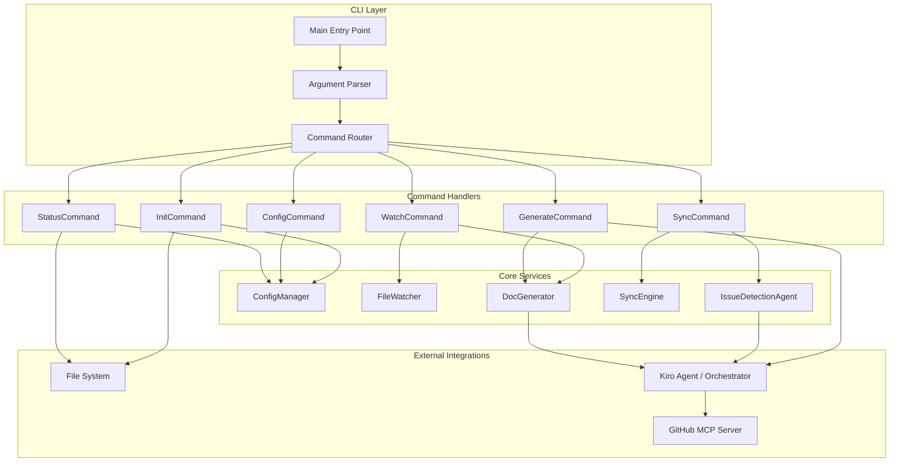

# Design Document: CLI Standalone Tool

## Overview

This design document describes the architecture and implementation approach for enhancing the Auto-Doc-Sync CLI to be a fully standalone tool. The CLI will use a command-based architecture with subcommands (`init`, `watch`, `generate`, `sync`, `config`, `status`) that can be used in any project, regardless of whether it's Kiro-native.

The design builds upon the existing `src/cli.ts` and `src/config.ts` infrastructure, extending it with a proper command pattern and adding new capabilities for initialization, file watching, and GitHub integration via the Kiro Agent and MCP.

## Architecture



## Components and Interfaces

### 1. Command Router

The command router dispatches CLI invocations to the appropriate command handler.

```typescript
interface Command {
  name: string;
  description: string;
  options: CommandOption[];
  execute(args: ParsedArgs): Promise<CommandResult>;
}

interface CommandOption {
  name: string;
  alias?: string;
  description: string;
  type: 'string' | 'boolean' | 'number';
  required?: boolean;
  default?: any;
}

interface CommandResult {
  success: boolean;
  message?: string;
  data?: any;
  exitCode: number;
}

interface ParsedArgs {
  command: string;
  subcommand?: string;
  options: Record<string, any>;
  positional: string[];
}
```

### 2. InitCommand

Handles project initialization and scaffolding.

```typescript
interface InitOptions {
  template: 'minimal' | 'standard' | 'comprehensive';
  dryRun: boolean;
  force: boolean;
}

interface InitResult {
  createdFiles: string[];
  createdDirectories: string[];
  configPath: string;
}

class InitCommand implements Command {
  async execute(args: ParsedArgs): Promise<CommandResult>;
  private scaffoldDirectory(template: string): Promise<InitResult>;
  private promptForOverwrite(): Promise<boolean>;
  private displaySummary(result: InitResult): void;
}
```

### 3. WatchCommand

Manages file watching and automatic documentation updates.

```typescript
interface WatchOptions {
  debounceMs: number;
  verbose: boolean;
}

interface WatchState {
  isRunning: boolean;
  changesProcessed: number;
  lastChangeTime?: Date;
  errors: WatchError[];
}

interface WatchError {
  file: string;
  error: string;
  timestamp: Date;
}

class WatchCommand implements Command {
  private watcher: FileWatcher;
  private state: WatchState;
  
  async execute(args: ParsedArgs): Promise<CommandResult>;
  private startWatching(patterns: string[]): void;
  private handleFileChange(filePath: string): Promise<void>;
  private gracefulShutdown(): void;
}
```

### 4. GenerateCommand

Handles manual documentation generation.

```typescript
interface GenerateOptions {
  files?: string[];
  type?: 'api' | 'readme' | 'changelog' | 'all';
  preview: boolean;
}

interface GenerateResult {
  generatedFiles: string[];
  updatedFiles: string[];
  skippedFiles: string[];
  noChanges: boolean;
}

class GenerateCommand implements Command {
  async execute(args: ParsedArgs): Promise<CommandResult>;
  private analyzeFiles(files: string[]): Promise<AnalysisResult>;
  private generateDocs(analysis: AnalysisResult, type: string): Promise<GenerateResult>;
  private previewChanges(result: GenerateResult): void;
}
```

### 5. SyncCommand

Handles documentation synchronization, conflict resolution, and triggers the Issue Detection Agent.

```typescript
interface SyncOptions {
  force: boolean;
  dryRun: boolean;
}

interface SyncResult {
  updatedFiles: string[];
  conflicts: ConflictInfo[];
  diffSummary: DiffSummary;
  hasChanges: boolean;
}

interface ConflictInfo {
  file: string;
  manualChanges: string[];
  generatedChanges: string[];
  resolution?: 'keep-manual' | 'use-generated' | 'merge';
}

interface DiffSummary {
  additions: number;
  deletions: number;
  modifications: number;
}

class SyncCommand implements Command {
  async execute(args: ParsedArgs): Promise<CommandResult>;
  private detectConflicts(files: string[]): Promise<ConflictInfo[]>;
  private promptForResolution(conflict: ConflictInfo): Promise<string>;
  private applySync(result: SyncResult): Promise<void>;
  
  /**
   * Triggers the Issue Detection Agent after sync completes with changes.
   * 
   * Implementation:
   * 1. Calls IssueDetectionAgent.analyzeChanges(syncResult)
   * 2. Iterates over the returned DetectedIssue[]
   * 3. For each issue, constructs a Kiro Agent Prompt containing issue details
   * 4. Executes the prompt via the Orchestrator to invoke GitHub MCP's issues_create tool
   */
  private triggerIssueDetection(result: SyncResult): Promise<void>;
}
```

### 6. ConfigCommand

Manages configuration display and modification.

```typescript
interface ConfigSubcommand {
  show: () => Promise<void>;
  set: (key: string, value: string) => Promise<void>;
  validate: () => Promise<ConfigValidationResult>;
  reset: () => Promise<void>;
}

class ConfigCommand implements Command {
  async execute(args: ParsedArgs): Promise<CommandResult>;
  private showConfig(): Promise<void>;
  private setConfigValue(key: string, value: string): Promise<void>;
  private validateConfig(): Promise<ConfigValidationResult>;
  private resetConfig(): Promise<void>;
}
```

### 7. StatusCommand

Provides system status and diagnostics.

```typescript
interface StatusInfo {
  initialized: boolean;
  configValid: boolean;
  lastSyncTime?: Date;
  watchedFiles: number;
  pendingChanges: string[];
  warnings: string[];
}

class StatusCommand implements Command {
  async execute(args: ParsedArgs): Promise<CommandResult>;
  private gatherStatus(verbose: boolean): Promise<StatusInfo>;
  private displayStatus(status: StatusInfo): void;
}
```

### 8. IssueDetectionAgent

Analyzes code changes and generates MCP payloads for GitHub issue creation. The agent does not directly call the GitHub MCP; it generates structured payloads that are executed via the Kiro Agent/Orchestrator.

```typescript
interface IssueDetectionConfig {
  enabled: boolean;
  githubRepo: string;              // REQUIRED: Target repository (e.g., "owner/repo")
  issueLabels: string[];           // Default labels to append to all created issues
  issueMinPriority: 'low' | 'medium' | 'high';  // Minimum priority filter
  maxIssuesPerSync: number;        // Rate limit (default: 5 per steering policy)
}

interface DetectedIssue {
  title: string;
  body: string;
  labels: string[];
  priority: 'low' | 'medium' | 'high';
  category: 'bug' | 'refactor' | 'documentation';
  location: {
    file: string;
    line?: number;
    functionName?: string;
  };
}

interface McpIssueCreationPayload {
  owner: string;
  repo: string;
  title: string;
  body: string;
  labels: string[];
}

interface CreateIssueResult {
  success: boolean;
  issueNumber?: number;
  issueUrl?: string;
  error?: string;
}

class IssueDetectionAgent {
  constructor(config: IssueDetectionConfig);
  
  /**
   * Analyzes sync results to detect potential issues.
   * Uses heuristics from AI Agent Issue Detection Policy.
   */
  async analyzeChanges(syncResult: SyncResult): Promise<DetectedIssue[]>;
  
  /**
   * Generates MCP-ready payloads for issue creation.
   * Does not execute creation - delegates to Kiro Agent.
   */
  async generateMcpPayloads(issues: DetectedIssue[]): Promise<McpIssueCreationPayload[]>;
  
  /**
   * Checks if GitHub MCP server is configured and accessible.
   */
  async isGitHubMCPAvailable(): Promise<boolean>;
  
  /**
   * Applies policy filters: minimum priority and rate limiting.
   * Returns null if issue should be filtered out.
   */
  private applyPolicy(issue: DetectedIssue): DetectedIssue | null;
  
  /**
   * Prioritizes issues when count exceeds maxIssuesPerSync.
   * High priority issues are selected first.
   */
  private prioritizeIssues(issues: DetectedIssue[]): DetectedIssue[];
  
  /**
   * Formats issue body according to steering policy template.
   */
  private formatIssueBody(issue: DetectedIssue): string;
}
```

### 9. FileWatcher

Monitors file system changes with debouncing.

```typescript
interface FileWatcherConfig {
  patterns: string[];
  excludePatterns: string[];
  debounceMs: number;
}

interface FileChangeEvent {
  type: 'add' | 'change' | 'unlink';
  path: string;
  timestamp: Date;
}

class FileWatcher {
  constructor(config: FileWatcherConfig);
  start(): void;
  stop(): void;
  onFileChange(callback: (event: FileChangeEvent) => void): void;
}
```

## Data Models

### Configuration Schema

```typescript
interface AutoDocConfig {
  version: string;
  workspace: WorkspaceConfig;
  analysis: AnalysisConfig;
  output: OutputConfig;
  watch: WatchConfig;
  sync: SyncConfig;
  issueDetection: IssueDetectionConfig;
}

interface WorkspaceConfig {
  root: string;
  kiroDir: string;
}

interface AnalysisConfig {
  includePatterns: string[];
  excludePatterns: string[];
  maxFileSize: number;
  analysisDepth: 'shallow' | 'deep';
}

interface OutputConfig {
  preserveFormatting: boolean;
  backupFiles: boolean;
  validateOutput: boolean;
}

interface WatchConfig {
  enabled: boolean;
  debounceMs: number;
  patterns: string[];
}

interface SyncConfig {
  conflictStrategy: 'prompt' | 'keep-manual' | 'use-generated';
  createBackups: boolean;
}

interface IssueDetectionConfig {
  enabled: boolean;
  githubRepo: string;              // REQUIRED: Target repository for issue creation
  issueLabels: string[];           // Default labels to append to all created issues
  issueMinPriority: 'low' | 'medium' | 'high';  // Minimum priority for issue creation
  maxIssuesPerSync: number;        // Rate limit per steering policy (default: 5)
}
```

### Template Types

```typescript
type TemplateType = 'minimal' | 'standard' | 'comprehensive';

interface TemplateDefinition {
  type: TemplateType;
  files: TemplateFile[];
  directories: string[];
  description: string;
}

interface TemplateFile {
  path: string;
  content: string;
  overwritable: boolean;
}
```

### State Persistence

```typescript
interface AutoDocState {
  lastSyncTime?: string;
  lastGenerateTime?: string;
  fileHashes: Record<string, string>;
  pendingChanges: string[];
}
```

### GitHub Issue Body Template

Per the AI Agent Issue Detection Policy, all created issues must follow this template:

```markdown
### 🤖 AI-Detected Issue

**Source File:** `{file_path}`
**Line/Context:** `{line_number_or_function_name}`

#### Description
{detailed_description_of_the_problem_and_why_it_was_flagged}

#### Suggested Action
{a_brief_suggestion_for_how_to_resolve_the_issue}

---
*Detected by Issue Detection Agent during `kiro-docs sync`.*
```


## Correctness Properties

*A property is a characteristic or behavior that should hold true across all valid executions of a system—essentially, a formal statement about what the system should do. Properties serve as the bridge between human-readable specifications and machine-verifiable correctness guarantees.*

### Property 1: Init creates correct directory structure

*For any* valid project directory, running `kiro-docs init` SHALL create the `.kiro/` directory with a valid `auto-doc-sync.json` configuration file that passes validation.

**Validates: Requirements 1.1**

### Property 2: Template scaffolding matches definition

*For any* template type (minimal, standard, comprehensive), the scaffolded files and directories SHALL exactly match the template definition for that type.

**Validates: Requirements 1.2**

### Property 3: Init summary completeness

*For any* successful initialization, the displayed summary SHALL contain the path of every file and directory that was created.

**Validates: Requirements 1.4**

### Property 4: Dry-run/preview idempotence

*For any* command with `--dry-run` or `--preview` flag, the file system state before and after execution SHALL be identical, while the output SHALL describe what would have been changed.

**Validates: Requirements 1.6, 3.6**

### Property 5: Watch triggers on pattern matches

*For any* file change event where the file path matches the configured include patterns and does not match exclude patterns, the watch mode SHALL trigger exactly one documentation update (after debounce).

**Validates: Requirements 2.2**

### Property 6: Debounce coalesces rapid changes

*For any* sequence of N file changes occurring within the debounce window, the watch mode SHALL trigger exactly one documentation update, not N updates.

**Validates: Requirements 2.5**

### Property 7: Generate processes all configured files

*For any* configuration with include/exclude patterns, running `kiro-docs generate` SHALL analyze exactly the set of files matching include patterns minus those matching exclude patterns.

**Validates: Requirements 3.1**

### Property 8: Generate filter options restrict scope

*For any* combination of `--files` and `--type` options, the generate command SHALL only process files in the intersection of: specified files (or all if not specified) AND matching doc types (or all if not specified).

**Validates: Requirements 3.2, 3.3**

### Property 9: Generate summary accuracy

*For any* generate execution, the summary output SHALL list exactly the files that were generated, updated, or skipped—with no omissions or false entries.

**Validates: Requirements 3.4**

### Property 10: Sync convergence

*For any* initial documentation state, running `kiro-docs sync` followed by another `kiro-docs sync` SHALL result in no changes on the second run (idempotence after convergence).

**Validates: Requirements 4.1**

### Property 11: Force sync overwrites completely

*For any* documentation state with conflicts, running `kiro-docs sync --force` SHALL result in documentation that exactly matches the generated documentation, with no manual edits preserved.

**Validates: Requirements 4.3**

### Property 12: Diff summary accuracy

*For any* sync execution, the reported diff summary (additions, deletions, modifications) SHALL exactly match the actual changes made to the file system.

**Validates: Requirements 4.4**

### Property 13: Config show completeness

*For any* valid configuration, `kiro-docs config show` SHALL display every configuration key-value pair present in the config file.

**Validates: Requirements 5.1**

### Property 14: Config set/get round-trip

*For any* valid configuration key and value, running `kiro-docs config set <key>=<value>` followed by `kiro-docs config show` SHALL display the newly set value for that key.

**Validates: Requirements 5.2**

### Property 15: Config validation consistency

*For any* configuration file, running `kiro-docs config validate` multiple times SHALL return the same validation result (errors and warnings) each time.

**Validates: Requirements 5.3**

### Property 16: Config reset restores defaults

*For any* modified configuration, running `kiro-docs config reset` SHALL result in a configuration that is identical to the default configuration.

**Validates: Requirements 5.5**

### Property 17: Status output completeness

*For any* system state, `kiro-docs status` SHALL accurately report: initialization status, configuration validity, and last sync time. With `--verbose`, it SHALL additionally report watched file count and pending changes.

**Validates: Requirements 6.1, 6.2**

### Property 18: Status warnings inclusion

*For any* system state with warnings (e.g., missing files, invalid config), `kiro-docs status` SHALL include all applicable warnings in its output.

**Validates: Requirements 6.4**

### Property 19: Issue agent triggers on sync changes

*For any* sync execution that results in `hasChanges: true`, the Issue Detection Agent SHALL be invoked to analyze the changes.

**Validates: Requirements 7.1, 7.2**

### Property 20: Issue payload structure

*For any* detected issue, the generated MCP payload SHALL contain: a non-empty title, a body following the steering policy template, the category label, and any configured additional labels.

**Validates: Requirements 7.4**

### Property 21: Issue agent respects configuration

*For any* Issue Detection Agent configuration, detected issues with priority below `issueMinPriority` SHALL be filtered out, and the number of created issues SHALL not exceed `maxIssuesPerSync`.

**Validates: Requirements 7.6**

## Error Handling

### Error Classification

| Error Type | Description | Recovery Strategy |
|------------|-------------|-------------------|
| `InitializationError` | Failure during `init` command (permissions, existing files) | Display clear message with remediation steps, exit with code 1 |
| `ConfigurationError` | Invalid or missing configuration | Display validation errors, suggest fixes, fall back to defaults where safe |
| `FileSystemError` | File read/write failures | Log error with file path, continue with other files if possible |
| `WatchError` | File watcher failures | Log error, attempt to restart watcher, continue monitoring |
| `GenerationError` | Documentation generation failures | Log error with context, skip affected file, continue with others |
| `SyncConflictError` | Unresolved conflicts during sync | Prompt user for resolution or abort if non-interactive |
| `ValidationError` | Output validation failures | Report specific validation errors, do not write invalid output |
| `MCPConnectionError` | GitHub MCP server unavailable | Log warning, continue without issue creation (per Req 7.5) |

### Error Recovery Patterns

1. **Graceful Degradation**: When non-critical components fail (e.g., MCP unavailable), log warning and continue with core functionality.

2. **Partial Success**: When processing multiple files, failures on individual files should not abort the entire operation.

3. **User Notification**: All errors should produce actionable messages with:
   - What failed
   - Why it failed (if determinable)
   - How to fix it

4. **Exit Codes**:
   - `0`: Success
   - `1`: General error
   - `2`: Configuration error
   - `3`: File system error
   - `4`: Validation error

## Testing Strategy

### Dual Testing Approach

This project uses both unit tests and property-based tests for comprehensive coverage:

- **Unit tests**: Verify specific examples, edge cases, and error conditions
- **Property tests**: Verify universal properties across randomly generated inputs

### Property-Based Testing Configuration

- **Library**: fast-check (TypeScript)
- **Minimum iterations**: 100 per property test
- **Tag format**: `Feature: cli-standalone-tool, Property {N}: {property_text}`

### Test Organization

```
src/
├── commands/
│   ├── init.ts
│   ├── init.test.ts           # Unit tests
│   ├── init.property.test.ts  # Property tests
│   ├── watch.ts
│   ├── watch.test.ts
│   ├── watch.property.test.ts
│   └── ...
├── services/
│   ├── fileWatcher.ts
│   ├── fileWatcher.test.ts
│   ├── issueDetectionAgent.ts
│   ├── issueDetectionAgent.test.ts
│   └── issueDetectionAgent.property.test.ts
└── ...
```

### Unit Test Focus Areas

- Command argument parsing edge cases
- Configuration validation with invalid inputs
- Error handling and recovery paths
- MCP unavailability scenarios
- File system permission errors

### Property Test Focus Areas

- Init scaffolding correctness (Properties 1-4)
- Watch mode behavior (Properties 5-6)
- Generate filtering and output (Properties 7-9)
- Sync convergence and accuracy (Properties 10-12)
- Config operations (Properties 13-16)
- Status reporting (Properties 17-18)
- Issue detection (Properties 19-21)

### Test Fixtures

- Temporary directories for file system tests
- Mock MCP server for GitHub integration tests
- Sample project structures for each template type
- Invalid configuration files for validation tests
