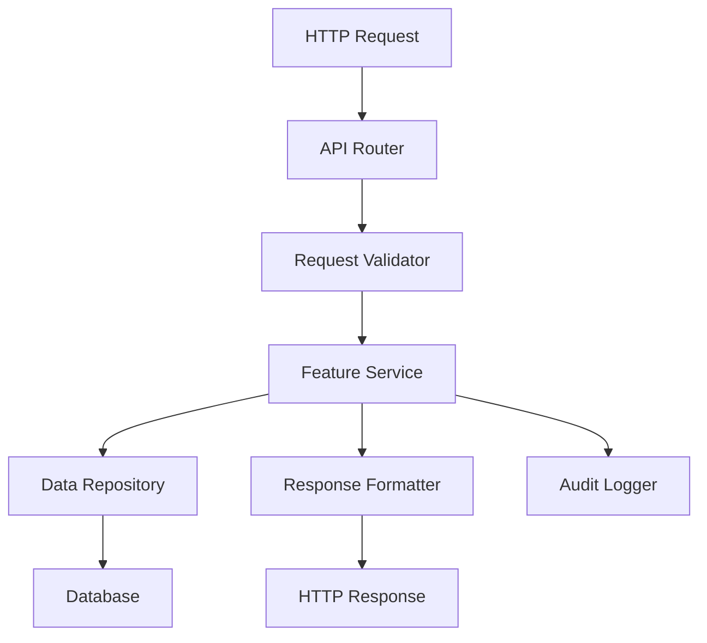

# Example Feature Design Document

## Overview

The Example Feature demonstrates a typical CRUD (Create, Read, Update, Delete) API implementation that showcases how the Auto-Doc-Sync System maintains design documentation. This feature implements a RESTful API with proper error handling, validation, and logging.

The system follows a layered architecture with clear separation between API endpoints, business logic, data access, and validation concerns.

## Architecture

The Example Feature uses a three-tier architecture:

1. **API Layer**: Express.js routes that handle HTTP requests and responses
2. **Service Layer**: Business logic and orchestration of operations
3. **Data Layer**: Database access and data persistence



## Components and Interfaces

### API Router
- **Purpose**: Handle HTTP routing and request/response processing
- **Dependencies**: Express.js, Request Validator, Feature Service
- **Endpoints**: GET, POST, PUT, DELETE operations for data entries

### Request Validator
- **Purpose**: Validate incoming request data against business rules
- **Dependencies**: Joi validation library
- **Validation Rules**: Data type checking, required field validation, business rule enforcement

### Feature Service
- **Purpose**: Implement business logic and coordinate operations
- **Dependencies**: Data Repository, Audit Logger, Response Formatter
- **Operations**: CRUD operations with business rule enforcement

### Data Repository
- **Purpose**: Abstract database operations and provide data access interface
- **Dependencies**: Database connection, ORM/Query builder
- **Methods**: Create, read, update, delete operations with transaction support

## Data Models

### DataEntry
```typescript
interface DataEntry {
  id: string;
  name: string;
  description: string;
  category: string;
  metadata: Record<string, any>;
  createdAt: Date;
  updatedAt: Date;
  version: number;
  isDeleted: boolean;
}
```

### CreateDataEntryRequest
```typescript
interface CreateDataEntryRequest {
  name: string;
  description: string;
  category: string;
  metadata?: Record<string, any>;
}
```

### UpdateDataEntryRequest
```typescript
interface UpdateDataEntryRequest {
  name?: string;
  description?: string;
  category?: string;
  metadata?: Record<string, any>;
  version: number; // For optimistic locking
}
```

### DataEntryResponse
```typescript
interface DataEntryResponse {
  id: string;
  name: string;
  description: string;
  category: string;
  metadata: Record<string, any>;
  createdAt: string;
  updatedAt: string;
  version: number;
}
```

## Correctness Properties

*A property is a characteristic or behavior that should hold true across all valid executions of a system-essentially, a formal statement about what the system should do. Properties serve as the bridge between human-readable specifications and machine-verifiable correctness guarantees.*

Property 1: Entry creation completeness
*For any* valid create request, the system should create a new entry with all required fields populated and return the complete entry data
**Validates: Requirements 1.1, 1.3**

Property 2: Input validation consistency
*For any* invalid input data, the system should reject the request and return appropriate validation errors without creating or modifying entries
**Validates: Requirements 1.2**

Property 3: Unique identifier assignment
*For any* successful entry creation, the system should assign a unique identifier that is different from all existing entry identifiers
**Validates: Requirements 1.3**

Property 4: Audit logging completeness
*For any* successful operation (create, update, delete), the system should create a log entry with timestamp, operation type, and relevant data
**Validates: Requirements 1.4, 3.5, 4.4**

Property 5: Retrieval accuracy
*For any* existing entry ID, the system should return the complete and current entry data matching that identifier
**Validates: Requirements 2.1**

Property 6: Non-existent entry handling
*For any* request for a non-existent entry ID, the system should return a 404 error with appropriate error message
**Validates: Requirements 2.2, 3.2, 4.2**

Property 7: Pagination consistency
*For any* request for multiple entries, the system should return results with consistent pagination metadata and correct page boundaries
**Validates: Requirements 2.3**

Property 8: Filter application accuracy
*For any* filter criteria, the system should return only entries that match all specified filter conditions
**Validates: Requirements 2.4**

Property 9: Partial update preservation
*For any* partial update request, the system should modify only the specified fields while preserving all other field values
**Validates: Requirements 3.3**

Property 10: Optimistic locking enforcement
*For any* concurrent update attempts, the system should detect version conflicts and prevent data corruption through optimistic locking
**Validates: Requirements 3.4**

Property 11: Dependency validation
*For any* deletion request for an entry with dependencies, the system should prevent deletion and return dependency information
**Validates: Requirements 4.3**

Property 12: Soft delete behavior
*For any* deletion operation when soft delete is configured, the system should mark entries as deleted rather than physically removing them
**Validates: Requirements 4.5**

## Error Handling

The system implements comprehensive error handling with specific error types and recovery strategies:

### Validation Errors
- **HTTP Status**: 400 Bad Request
- **Response Format**: Structured validation error details
- **Recovery**: Client should correct input and retry

### Not Found Errors
- **HTTP Status**: 404 Not Found
- **Response Format**: Error message with resource identifier
- **Recovery**: Client should verify resource exists

### Conflict Errors
- **HTTP Status**: 409 Conflict
- **Response Format**: Conflict details and current resource state
- **Recovery**: Client should refresh data and retry with current version

### Dependency Errors
- **HTTP Status**: 422 Unprocessable Entity
- **Response Format**: List of dependent resources preventing operation
- **Recovery**: Client should resolve dependencies before retrying

### Server Errors
- **HTTP Status**: 500 Internal Server Error
- **Response Format**: Generic error message (details logged internally)
- **Recovery**: Client should retry after delay or contact support

## Testing Strategy

The Example Feature employs comprehensive testing using both unit tests and property-based tests.

### Unit Testing Approach
Unit tests focus on:
- API endpoint behavior with known inputs
- Validation logic with specific test cases
- Error handling scenarios
- Database operation success and failure cases
- Integration between service components

### Property-Based Testing Approach
Property-based tests verify universal properties using **fast-check** library:
- Each property-based test runs a minimum of 100 iterations
- Tests generate random entry data, IDs, and operation sequences
- Properties verify correctness across all possible inputs
- Each test is tagged with the format: **Feature: example-feature, Property {number}: {property_text}**

**Property-Based Testing Requirements:**
- Use fast-check library for generating test data
- Configure each test to run minimum 100 iterations
- Tag each test with explicit reference to design document property
- Generate realistic data entries and operation sequences
- Verify system behavior across diverse input scenarios

### Test Coverage Requirements
- Unit tests cover specific examples and integration points
- Property tests verify universal correctness properties
- Both approaches are complementary and required for comprehensive validation
- Tests focus on core CRUD functionality with minimal over-testing of edge cases